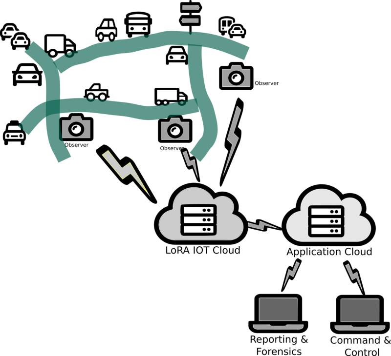

# Vehicle Brand Dataset Scraping

This collection of apps scrapes car images from Autotrader website in order to create a dataset of car brands for Machine Learning (ML). 
Autotrader is one of those websites that the owners would prefer are not scraped in bulk, since this undermines their commercial advantage. 
They have therefore made is very difficult to scrape with all sorts of technical chicanery, 
but it can be done without anyone at Autotrader noticing, 
by using some clever magic that comes at a monetary cost: 
This app uses the best scraper service API currently available, Scraping Bee. 

For now, the app collection only scrapes the UK-based Autotrader website in order to build a UK-based dataset of vehicle brands for cars, pickup trucks ('bakkies' in South Africa, OK?), vans, HGVs and campers.

## What would we use this dataset for?

Firstly, crime prevention and detection. Following on, so much more else too, like finer traffic control management. 
Want to make a case to your local council for building that bypass around your village, already?

With a comprehensive set of images of each of the popular vehicle brands, it should be possible to "teach" a machine-learning application 
to recognize car brands in real-time from live video and camera observations. This gives an added attribute to
a vehicle-of-interest's registration / license plate, or at least provides some backup information where
the license plate could not be read.

The better quality the learning data is (i.e. the less extraneous information is included), the faster, smaller and more
efficient the resulting image analysis will be. This means that image processing could possibly be done directly on the 
embedded camera hardware using Edge-AI and Tiny-ML techhniques. One advantage of doing the analysis locally at the camera is that 
the results of the image processing can be transmitted in real time over very low bandwith connections and over great distances, 
than the actual image itself. Typically, the LoRa transmission protocol is used for transmitting the essential data in real-time, 
and the images themselves can be manually collected over WiFi during routine drive-by data collection or by daiy-chaining them in 
a WiFi grid network.



# Scrape your own Dataset

You can either download the published dataset from https://www.kaggle.com/bignosethethird/uk-car-brands-dataset
or build your own dataset, or use this code as an example of how to scrape another website that _really_, _really_ does not want to be scraped.

## Get your own cool API key!

If you want to enhance the dataset further or create datasets for other countries in which Autotrader operates, 
you can make a few configuration changes in the ScrapeUKCarsDataset.py Python script. 

You will also need your own API key, at $29 per month. Sign up through this link and get your own API key <sup id="a1">[1](#f1)</sup>:

https://www.scrapingbee.com?fpr=nobnose-inc27

## Getting a healthy data set for Machine Learning

We ideally want about 100 images per brand for a healthy dataset for the Machine Learning. 
A rule of thumb is that 100 images should be sufficient to teach an ML instance about each category. 
You can top up images until you have this amount by re-running this app after every curation
exercise. Also run this app every few weeks to top up the image counts for those more obscure 
brands for which you have not yet managed to get 100 good images so far. 
Expect to loose 25% of the new images per curation exercise, so it is a good idea to set the
number of images per brand to 150 the first time that you run it:

```
imagesPerBrand=150
```

## Running the scraper

Update your API key in the first line of the script and set your current working directory to a partition with lost of space available. 

If you want to add to the existing set, unpack the set there. You can get the latest, curated publication of the dataset here on kaggle.com:

https://www.kaggle.com/bignosethethird/uk-car-brands-dataset

Then run the script to augment the dataset.

```
./ScrapeUKCarsDataset.py
```

A log file will be created, called ScrapeUKCarsDataset.log when ScrapeUKCarsDataset.py is run. You can view the logfile:

```
tail -f ScrapeUKCarsDataset.log
```

Or better still, use the ```logwatch``` utiliy that is also in this git repo for groovy colourful text output.

```
logwatch.sh ScrapeUKCarsDataset.log
```

## Curating the collection of images

### Curation Round 1 - Deduplicate

The first curation step is to remove all duplicate images. These are caused by advertisers using 
generic stock images or simply their logo. There is unlikely going to be be any useful,so just 
summarily remove them first of all with the command

```
fdupe -rd UKCarsDataset
```

This app selects only the main image per advertised car, which is usually a front-on view with a
slight side angle, like in a fashion shoot. This is exactly what we want, since the 
observation camera will mostly be placed facing oncoming traffic on the side of the road.

### Curation Round 2

The second curation step is to visually inspect all your new files and remove those that are
not useful for ML, like a side view, interio - Visual inspectionr view, obvious dealership signage, a girly model
draped across the car's hood, big for-sale text and price in front window, etc., 
If you remove these images, you can rerun the scraping process a few weeks later
when the offending vehicles have been removed from the website.

### Curation Round 3 - Remove background

Remove the background from all the images, using a public utility called ```backgroundremover```. 
To install it, use ```pip```:

```
# pip install backgroundremover
````

See the file ```BackgroundRemove.sh``` on how this used.

### Curation Round 4 - Remove registration numbers

Finally, all the registration number plates need to be blanked out from the images. 
Use the utility BlankRegPlate that is also in this repo:
This is still work in progress and is not perfect. Manually verify your results.

```
find UKCarsDataset -type f -name "*.jpg" -exec ./BlankRegPlate.py {} \;
```

Images where the number plate blanking failed will be notified and you may need to manually remove them using a GIMP or Photoshop, or just remove them and just go scrape some more images.

## Curation Round 5 - Preparing for use in other AI / ML applications

It may be useful to put all the files into one directory and to move the attributes of the directories into the file name. 
Furthermore, to avoid ambiguity, two-word attributes can be combined into single terms by hyphenating them.

```
mkdir ALLFILES
cd ALLFILES
$ find .. -name "*.png" -type f -print | sed -e 's|\(.*\)/\(.*\)/\(.*\)/\(.*\.png\)|cp "\1/\2/\3/\4" "./\2_\3_\4"|' > runme.sh
sh ./runme.sh
rename 's/UKVansDataset/Van/' *
rename 's/UKCarsDataset/Car/' *
rename 's/UKTrucksDataset/Truck/' *
rename 's/UKPickupsDataset/Pickup/' *
rename 's/ /-/g' *
```

You should end up with file names like ```Van_VOLKSWAGEN_202106103709129.png```, which is useful for AI / ML apps like EdgeImpulse.

---
<sup><b id="f1">1</b> Yes, this is an underhand attempt to score a little affiliation fee. This project stagnated in 2013 and needs some urgent funding!</sup>

---

## Some pictures to drool over, compiled from this dataset
 
### AstonMartin
 


 
### Ferrari
 


 
### Lamborghini
 

 
 
### Lotus
 

 
 
### McLaren
 

 
 
### Rolls Royce
 


 
